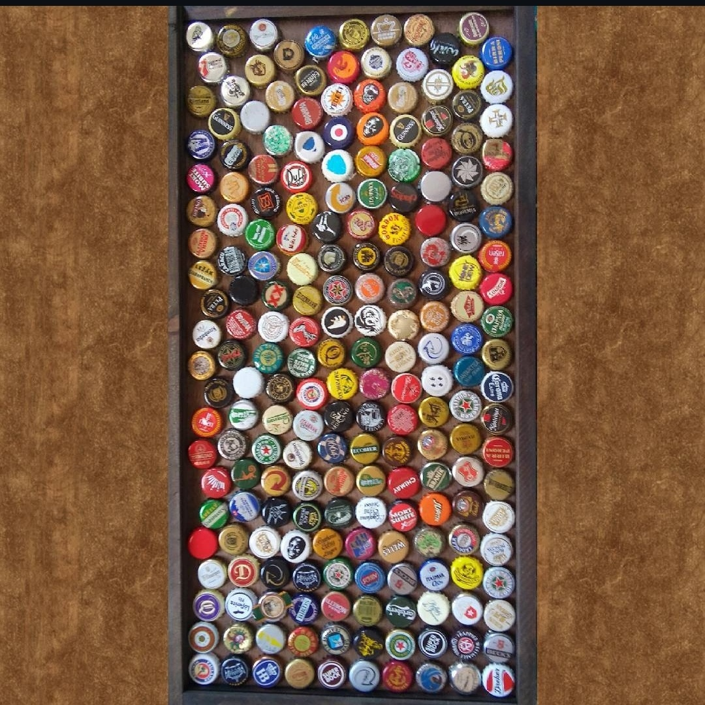
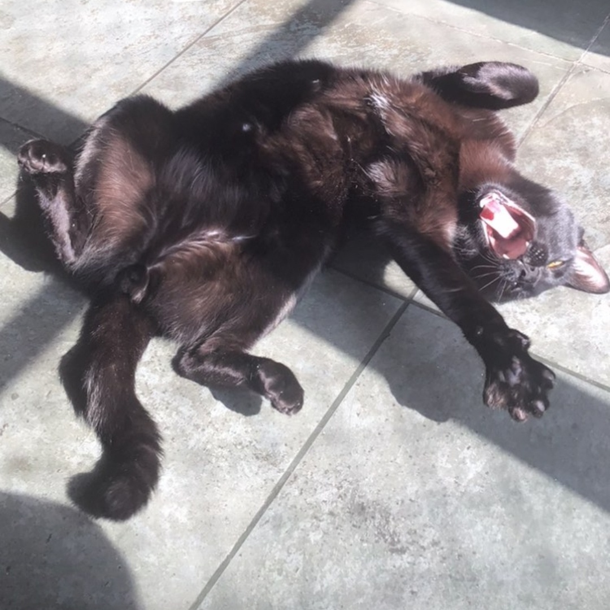

# Fagner de Assis Moura Pimentel

Olá! Seja bem-vindo ao meu GitHub. 👋 Que bom te ver por aqui! 😎

Eu sou **Fagner Pimentel**: professor universitário, roboticista e pesquisador. Também trabalho com **desenvolvimento web** e **desenvolvimento de jogos**. Aqui você encontra algumas ferramentas que fazem parte do meu dia a dia:

  
  
  
  
  
  
  
  
  

Sou **Bacharel em Sistemas de Informação** pela [UNEB](https://portal.uneb.br/), **Mestre em Ciência da Computação** (ênfase em Visão Computacional) pela [UFBA](https://www.ufba.br/) e [UEFS](https://www.uefs.br/), e **Doutor em Engenharia Elétrica** (ênfase em Robótica) pelo [Centro Universitário FEI](https://portal.fei.edu.br/). 🎓🤖

Atualmente sou [Professor Universitário](https://github.com/FagnerPimentel-Academic) no Centro Universitário FEI, lecionando disciplinas de:

- **Desenvolvimento Web** 💻
- **Desenvolvimento de Jogos** 🎮
- **Robótica** (Navegação de robôs, Manipuladores, Interface Humano-Robô) ⚙️

Também sou coordenador da competição [**RoboCup@Home Brasil Open**](https://github.com/RoboCupAtHomeLatinAmerica), voltada ao desenvolvimento de robôs de serviço para ambientes domésticos. A competição avalia robôs em testes realistas de usabilidade e desempenho. 🏠🤖

---

### Meus hobbies:

No tempo livre, curto:

- Assistir **musicais** 🎭  
- Cozinhar **receitas novas** 🍳  
- Jogar **jogos retrô (16 bits)** 🕹️  
- Andar de **moto** 🏍️  
- **Leitura** 📖
- **colecionar tampinhas de cerveja** 🍻  
- Aprender coisas novas como **datilografia**, **VIM** e **idiomas** (inglês, espanhol… em breve francês e japonês também!) 🌍✍️  
- Conhecer **comidas de rua** nos lugares por onde passo 🍜🌮  
- Me aventurar com experiências únicas (tipo pular de paraquedas! ✈️)

E claro, sou apaixonado pelo meu gato, o **Moqueca**. 🐈‍⬛

---

### Algumas fotos dos meus hobbies:

| | | |
|--|--|--|
|  **Viagem de Moto** 🏍️🛣️ |  **Coleção de tampinhas** 🍺🍻 |  **Churrasquinho Chinês** 🥡🍖 |
|  **Salto de paraquedas** ✈️☁️ |  **Moqueca, meu gato** 🐈‍⬛❤️ | |

---

### Meus Status do GitHub:

  
  

---

### Principais Repositórios:

---

### Principais organizações que contribuo:

- [**FagnerPimentel-Academic**](https://github.com/FagnerPimentel-Academic) 🎓  
- [**RoboCupAtHomeLatinAmerica**](https://github.com/RoboCupAtHomeLatinAmerica) 🤖  
