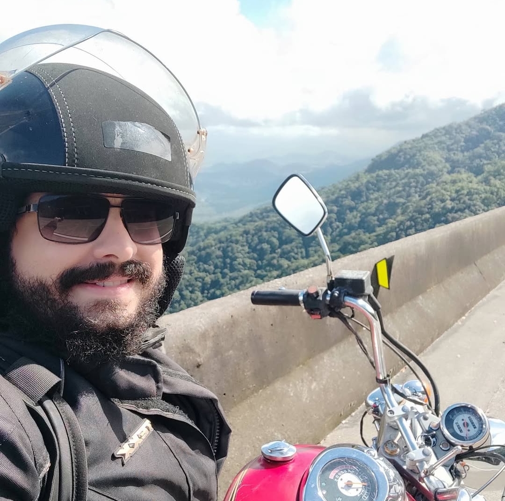
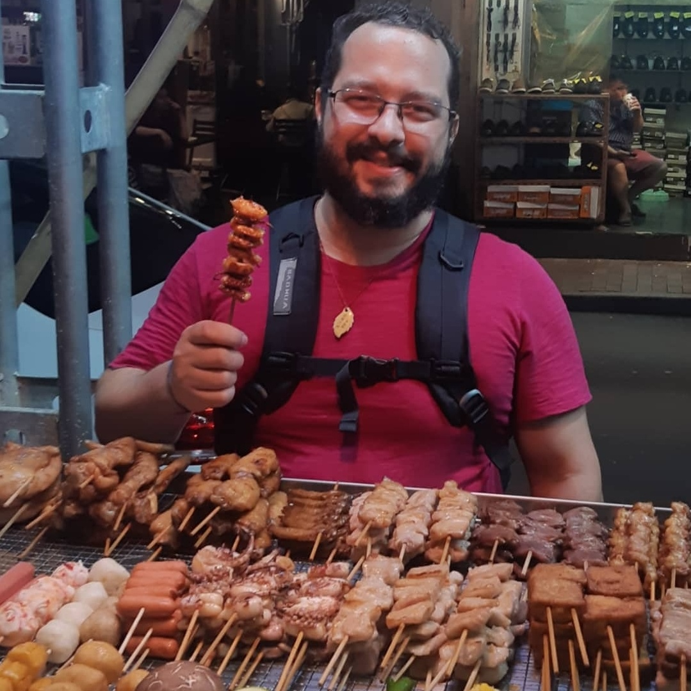
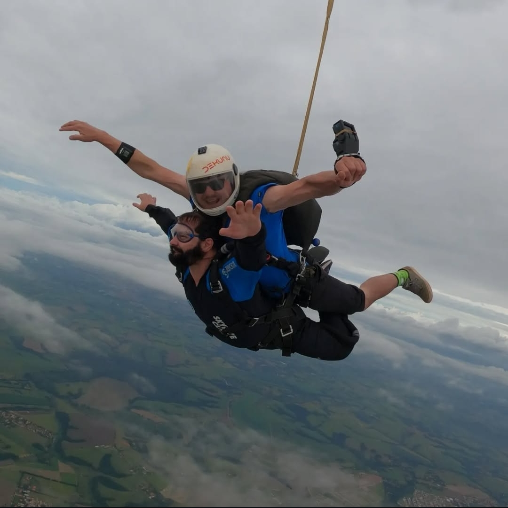

# Fagner de Assis Moura Pimentel

Olá! Seja bem-vindo ao meu GitHub. 👋 Que bom te ver aqui! 😎

Eu sou Fagner Pimentel. Professor universitário, roboticista e pesquisador. Também trabalho com desenvolvimento web e desenvolvimento de jogos. Aqui você encontra algumas ferramentas que eu uso no meu trabalho:

  
  
  
  
  
  
  
  
  

Eu sou Bacharel em Sistemas de Informação pela [Universidade Estadual da Bahia (UNEB)](https://portal.uneb.br/), Mestre em Ciência da Computação com ênfase em Visão Computacional pela [Universidade Federal da Bahia (UFBA)](https://www.ufba.br/) e pela [Universidade Estadual de Feira de Santana (UEFS)](https://www.uefs.br/) e Doutor em Engenharia Elétrica com ênfase em Robótica pelo [Centro Universitário FEI (FEI)](https://portal.fei.edu.br/).

Atualmente sou [Professor Universitário](https://github.com/FagnerPimentel-Academic) no Centro Universitário FEI, lecionando disciplinas de Desenvolvimento WEB, Desenvolvimento de Jogos e Robótica (Navegação de robôs, Manipuladores, Interface Homem-Robô).

Atualmente eu também coordeno a competição [RoboCup@Home Brasil Open](https://github.com/RoboCupAtHomeLatinAmerica). Essa competição visa desenvolver tecnologia de robôs de serviço e assistência com alta relevância para futuras aplicações domésticas. Um conjunto de testes é utilizado para avaliar as habilidades e o desempenho dos robôs em um ambiente doméstico realista.

Meus hobbies atualmente são assistir musicais, cozinhar, jogar jogos retrô (16 bits), gosto de andar de moto, leitura e colecionar tampinhas de cerveja. Também estou tentando aprender coisas novas como datilografia e VIM e melhorar meu inglês e espanhol (em breve quero começar francês e japonês também). Gosto muito de conhecer comidas locais (comida de rua) nos lugares que vou e sempre tento ter novas experiências (como pular de paraquedas 😁). Por fim, deixo aqui uma fotinha do meu gato, o Moqueca.

---

### Algumas fotos dos meus hobbies:

| | | |
|--|--|--|
|  **Viagem de Moto** ğŸï¸ğŸ›£ï¸ |  **Coleção de tampinhas** ğŸºğŸ» |  **Churrasquinho Chinês** 🥡🖠|
|  **Salto de paraquedas** ✈️☁️ |  **Moqueca, meu gato** 🐈‍⬛❤️ | |

---

### Meus Status do GitHub:

  
  

---

### Principais Repositórios:

---

### Principais organizações que contribuo:

- [FagnerPimentel-Academic](https://github.com/FagnerPimentel-Academic)  
- [RoboCupAtHomeLatinAmerica](https://github.com/RoboCupAtHomeLatinAmerica)
